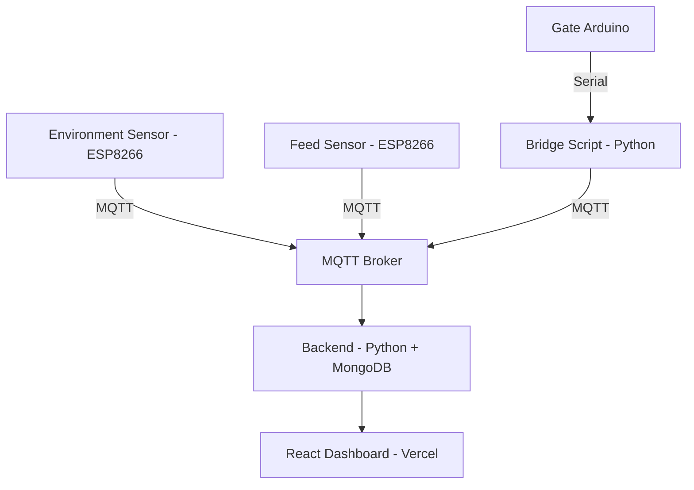

# 🐄 CattleNet — Solar-Powered IoT Livestock Monitoring System

**Real-time environment, feed, and gate monitoring for cattle sheds — built on ESP8266/Arduino hardware, MQTT, and a full-stack web dashboard.**

🔗 **Live Demo:** [cattle-net.vercel.app](https://cattle-net.vercel.app)

> ⚠️ **Note:** The hardware devices (ESP8266/Arduino sensors) are not powered/connected 24x7. When offline, the dashboard displays the last recorded values or demo/test data instead of live real-time readings. This is expected — the full sensor-to-dashboard pipeline works end-to-end when hardware is active.

---

## 📖 Overview

CattleNet is an end-to-end IoT system designed to help farmers remotely monitor livestock shed conditions without manual checks. It combines low-cost embedded hardware with a solar power setup, MQTT-based communication, and a live web dashboard — built to be affordable and deployable in rural, low-infrastructure environments.

The system tracks three things in real time:
- **Environment conditions** inside the shed
- **Feed levels** to reduce manual monitoring
- **Gate access**, with automated control

## ✨ Features

- 📡 **Real-time sensor data** pushed over MQTT from ESP8266/Arduino devices to a live dashboard
- 🌦️ **Environment monitoring** — shed conditions tracked continuously
- 🍽️ **Feed level tracking** — alerts when feed runs low
- 🚪 **Automated gate control** — triggered and logged via serial-to-MQTT bridge
- ☀️ **Solar-powered hardware** — built for off-grid, rural deployment
- 📊 **Web dashboard** — live data visualization, historical values, and status indicators
- 🗄️ **Persistent storage** — sensor history stored in MongoDB for trend analysis

## 🏗️ System Architecture



## 🛠️ Tech Stack

**Hardware:** ESP8266, Arduino, MQTT protocol, solar power setup
**Backend:** Python, MQTT (paho-mqtt), MongoDB
**Frontend:** React, Tailwind CSS
**Deployment:** Vercel (frontend), [your backend host]
**Communication:** MQTT (device ↔ backend), REST API (backend ↔ frontend)

## 📁 Repository Structure

```
Cattlenet/
├── Cattlenet_Hardware_Codes/
│   ├── Environment_Device_ESP8266.ino
│   ├── Feed_Monitoring_Device_ESP8266.ino
│   ├── Gate_Device_Arduino.ino
│   └── serial_to_mqtt_Gate_Device.py
│
└── Cattlenet_Software/
    ├── backend/
    └── src/
```

## 🚀 Getting Started

### Hardware Setup
See [`Cattlenet_Hardware_Codes/README.md`](./Cattlenet_Hardware_Codes/README.md) for firmware flashing and wiring instructions.

### Software Setup

**Backend:**
```bash
cd Cattlenet_Software/backend
pip install -r requirements.txt
python app.py
```

**Frontend:**
```bash
cd Cattlenet_Software
npm install
npm start
```

Create a `.env` file in both `backend/` and root `Cattlenet_Software/` based on the variables your app expects (MongoDB URI, MQTT broker address, API keys) — not committed to this repo for security.

## 📸 Demo

🔗 Live: [cattle-net.vercel.app](https://cattle-net.vercel.app)
*(Shows last-known/demo data when hardware is offline — see note above)*

## 👤 Author

**Mohammed Mudassir**
ECE Graduate 
[GitHub](https://github.com/amohammedmudassir) · [LinkedIn](https://www.linkedin.com/in/a-mohammed-mudassir-841523309/)
